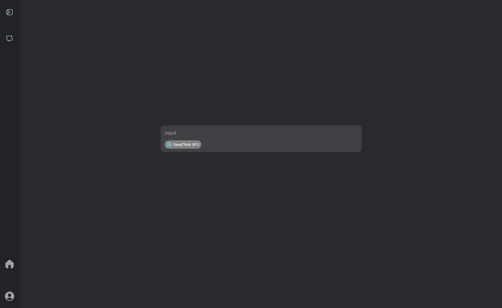
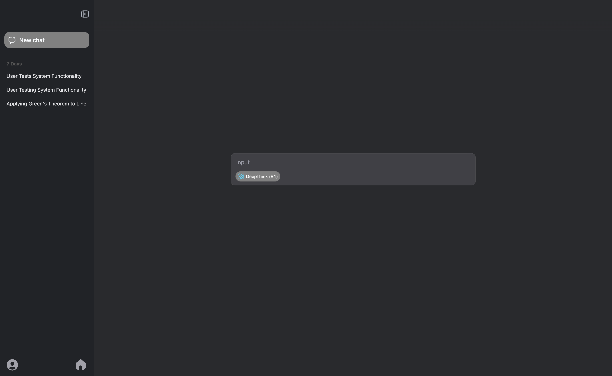
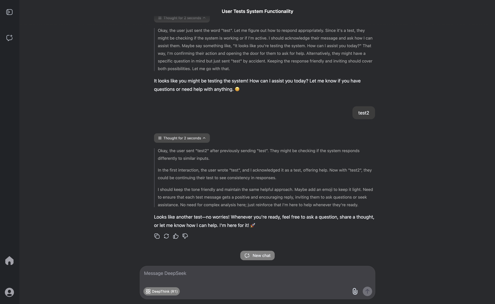

This repo contains some user CSS and JS for an opinionated "debloat" of the deepseek website (https://chat.deepseek.com/).

It is intended for Arc Browser's boost system and exclusively tested on that browser, but the code is intentionally designed to work outside of boosts and on other browsers (as long as they are relatively modern and updated ones), although again is currently untested in that regard.

> **NOTE: There are some noticeable style and DOM changes when loading a page for the first time that may be a dealbreaker for some.**

This lag may be reduced in the future, see [Side Note](#side-note).

It is suggested if on Arc to install the boost, as while the css/code manually "zaps" elements (both by first injecting hide styles then by actually deleting them from the DOM), an Arc boost's zaps appear to hide them even faster than our CSS injection, at least as far as boosts are concerned. This helps reduce any jarring/visible DOM and style changes on page load.

While currently untested on other browsers, my general recommendation for now when installing on them is that if there are any unreasonable and noticeable initial page load style changes, try also using any extensions (such as uBlock Origin) or features of the browser that are similar to Arc's zap. This is because they may be able to inject themselves faster than addended CSS/JS would. 

Hide whatever elements bother you or the same that we hide. 
Our selectors are under the `injectHideStyles` function in the JS, with the addition of `".eb23581b.dfa60d66"` in styles.css because the current code is an uncontrollable disaster on many levels.

## Recommended installation guide
### Arc Browser
1. Install the current version of the boost here: https://arc.net/boost/00FE36A4-1E9F-4E94-9087-5A817ADD0958 
2. Copy and paste the JS from [main.js](./main.js) into the text box inside `Code` > `JS` of the boost's settings.

It is not necessary to copy and paste any CSS from [styles.js](./styles.css) into the boost as the boost comes with them pre-inserted.
The JavaScript doesn't come with the boost as Arc doesn't allow sharing boosts with JS for security reasons.

## Installing on other Browsers or not as an Arc boost
There are many ways but you can try the violentmonkey extension if your browser supports it. However, I have not tested other browsers and non-boost methods yet, but there is no real reason it shouldn't work as it's just some JS and CSS that needs to be copy pasted in the right areas.

TL;DR: Figure it out, there are many ways to add custom userscripts and styles for specific websites and pages.

## Important notes
### Noteable changes
1. The JS by default automatically enables R1 mode on every page load or reload where the `DeepThink (R1)` button is visible. You can still disable it for the session (if you never reload) just by clicking it.
If you want to disable this, set `ENABLE_R1_ON_EVERY_PAGE_LOAD_OR_RELOAD` to false in the JS (it's at the top of the script). 
    - I think the site generally keeps track of your last setting but I didn't want to find out if and where it would be inconsistent, especially coming from
ChatGPT, and I only ever really use the reasoning model so this is an easy default for me.
2. The CSS/JS by default automatically hides/removes the `Search` button because I never use it. This is currently not disableable.
3. The CSS/JS removes all deepseek branding and their blue aesthetic, and adds a home button on the sidebar's bottom to replace the logo's functionality.
4. `Cmd+Shift+S` or `Ctrl+Shift+S` toggles the sidebar depending on your keyboard/OS.
    - A friend suggested this to me, as I didn't even know ChatGPT has this feature as well. It's nice.
### What it works for
This is currently only designed for dark mode. Using this with light mode will have poorly fitting colors to the light mode aesthetic and also introduce other strange results as their CSS/DOM structure appears to be a bit different in light mode.
### When it will break
This can very easily break in the future as they update the site, and I may lag to update it if I am still using ChatGPT more by then.
The CSS & JS currently rely on an especially lazy implementation using specific CSS class names and DOM structures that are completely unreliable and annoying to maintain.

## Screenshots

## Licenses
- [BSD-2-Clause](./LICENSE) for all software components (i.e. the *.css and *.js files).
- [CC0](./LICENSE_NONSOFTWARE) for all non-software components (i.e. README.md and screenshots under [repo_media](./repo_media))

## Side note
The code is a shit fest, as I forgot the !important keyword existed for some time and therefore much of what the JavaScript does should be moved to CSS (I was too lazy to figure out and overcome every single case of specificity the website was overruling the custom styles for, so I resorted to the horrors and lag of adding inline styles after page load, not that !important isn't necessarily horrifying either).

It may be completely refactored to address this in the future when the site releases a breaking change, but for now it works good enough for me.